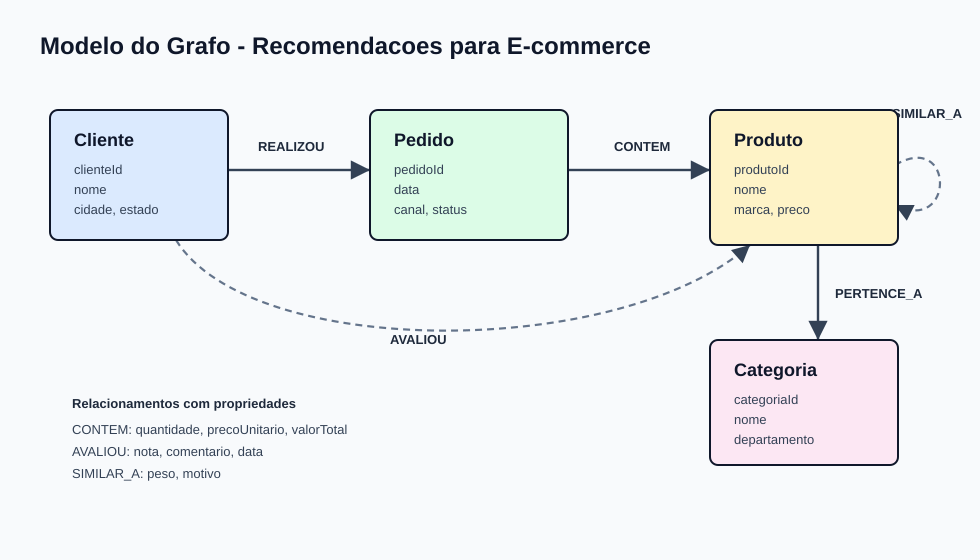

# Neo4j - Grafo de Recomendacoes para E-commerce

Projeto desenvolvido para o desafio da DIO com foco em banco de dados em grafos usando Neo4j. A proposta e modelar uma base de e-commerce para responder perguntas de negocio sobre recomendacao de produtos, perfil de clientes, categorias mais relevantes e oportunidades de venda cruzada.

## Contexto do Problema

Lojas virtuais normalmente armazenam pedidos, produtos e clientes em tabelas separadas. Esse modelo funciona bem para transacoes, mas pode dificultar perguntas que dependem de conexoes, por exemplo:

- Quais produtos devem ser recomendados para um cliente com base em compras de pessoas parecidas?
- Quais categorias aparecem juntas nos mesmos pedidos?
- Quais clientes compraram produtos similares, mas ainda nao compraram determinado item?
- Quais produtos concentram melhores avaliacoes dentro de uma categoria?

Como essas respostas dependem de caminhos e relacionamentos, um banco de dados em grafos e uma escolha natural.

## Por que Usar Grafos?

O Neo4j permite representar entidades de negocio como nos e conexoes diretas entre elas. Neste projeto:

- `Cliente` realiza `Pedido`
- `Pedido` contem `Produto`
- `Produto` pertence a `Categoria`
- `Cliente` avalia `Produto`
- `Produto` pode ser similar a outro `Produto`

Com esse modelo, perguntas de recomendacao deixam de depender de muitas juncoes e passam a ser exploradas por travessias no grafo.

## Modelo do Grafo



Detalhes do modelo tambem estao documentados em [docs/modelo-grafo.md](docs/modelo-grafo.md).

## Estrutura do Repositorio

```text
.
├── README.md
├── data/
│   ├── avaliacoes.csv
│   ├── categorias.csv
│   ├── clientes.csv
│   ├── itens_pedido.csv
│   ├── pedidos.csv
│   ├── produtos.csv
│   └── similaridades.csv
├── cypher/
│   ├── 00_constraints.cypher
│   ├── 01_load_data.cypher
│   └── 02_business_queries.cypher
└── docs/
    ├── evidencias/
    │   └── README.md
    ├── modelo-grafo.md
    └── schema.svg
```

## Como Executar

### 1. Criar uma base no Neo4j

Voce pode usar Neo4j Desktop, Neo4j Aura ou um container Docker local.

Exemplo com Docker:

```bash
docker run \
  --name dio-neo4j \
  -p 7474:7474 -p 7687:7687 \
  -e NEO4J_AUTH=neo4j/senha123 \
  -v "$PWD/data:/var/lib/neo4j/import" \
  neo4j:latest
```

Depois acesse o Neo4j Browser em:

```text
http://localhost:7474
```

### 2. Preparar constraints

Execute o arquivo:

```cypher
:source cypher/00_constraints.cypher
```

Se estiver usando o Neo4j Browser sem acesso direto ao arquivo, copie e cole o conteudo do script.

### 3. Carregar os dados

Execute:

```cypher
:source cypher/01_load_data.cypher
```

O script usa `LOAD CSV WITH HEADERS`, portanto os arquivos `.csv` precisam estar no diretorio de importacao do Neo4j.

### 4. Rodar as perguntas de negocio

Execute as consultas em:

```cypher
:source cypher/02_business_queries.cypher
```

## Perguntas de Negocio Respondidas

1. Quais produtos um cliente deve receber como recomendacao?
2. Quais produtos sao frequentemente comprados juntos?
3. Quais categorias geram maior valor em vendas?
4. Quais clientes tem perfil de compra parecido?
5. Quais produtos possuem melhor avaliacao media?
6. Quais produtos similares podem substituir um item indisponivel?

As consultas completas estao em [cypher/02_business_queries.cypher](cypher/02_business_queries.cypher).

## Evidencias Visuais

A pasta [docs/evidencias](docs/evidencias) contem um guia com sugestoes de prints para comprovar o funcionamento do grafo no Neo4j Browser, Bloom ou Explore.

Sugestao de evidencias:

- Visualizacao geral do schema com `CALL db.schema.visualization()`
- Grafo de recomendacao de produtos para um cliente
- Produtos comprados juntos
- Caminho entre cliente, pedido, produto e categoria
- Ranking de produtos por avaliacao

## Troubleshooting

### Erro: Couldn't load the external resource

Verifique se os arquivos CSV estao na pasta de importacao do Neo4j. Em Docker, confirme se o volume foi montado com:

```bash
-v "$PWD/data:/var/lib/neo4j/import"
```

### Erro de senha no Neo4j Browser

Use o usuario e senha configurados no container:

```text
usuario: neo4j
senha: senha123
```

### Dados duplicados apos rodar o script mais de uma vez

Os scripts usam `MERGE` para reduzir duplicidade nos nos principais. Mesmo assim, para reiniciar o ambiente de estudo, voce pode limpar a base antes de recarregar:

```cypher
MATCH (n) DETACH DELETE n;
```

### A visualizacao ficou muito poluida

Comece com consultas menores, usando `LIMIT`, ou filtre por um cliente especifico:

```cypher
MATCH p=(c:Cliente {clienteId: 'C001'})-[:REALIZOU]->(:Pedido)-[:CONTEM]->(:Produto)
RETURN p;
```

## Proximos Passos

- Adicionar dados reais anonimizados ou um dataset publico.
- Criar recomendacoes por comunidades de clientes.
- Usar Graph Data Science para similaridade, centralidade e deteccao de comunidades.
- Publicar prints reais na pasta `docs/evidencias`.

## Referencia

Exemplos oficiais da Neo4j para inspiracao: [neo4j-graph-examples](https://github.com/neo4j-graph-examples)
