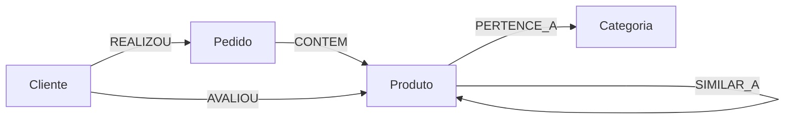

# Modelo do Grafo

## Labels

### Cliente

Representa uma pessoa que realizou compras na loja.

Propriedades:

- `clienteId`
- `nome`
- `cidade`
- `estado`
- `segmento`

### Pedido

Representa uma compra realizada por um cliente.

Propriedades:

- `pedidoId`
- `data`
- `canal`
- `status`

### Produto

Representa um item vendido pela loja.

Propriedades:

- `produtoId`
- `nome`
- `marca`
- `preco`

### Categoria

Representa a classificacao comercial do produto.

Propriedades:

- `categoriaId`
- `nome`
- `departamento`

## Relacionamentos

### Cliente - REALIZOU -> Pedido

Indica que um cliente realizou determinado pedido.

### Pedido - CONTEM -> Produto

Indica os produtos presentes em um pedido.

Propriedades:

- `quantidade`
- `precoUnitario`
- `valorTotal`

### Produto - PERTENCE_A -> Categoria

Indica a categoria comercial do produto.

### Cliente - AVALIOU -> Produto

Indica a avaliacao feita por um cliente.

Propriedades:

- `nota`
- `comentario`
- `data`

### Produto - SIMILAR_A -> Produto

Indica similaridade manual ou calculada entre dois produtos.

Propriedades:

- `peso`
- `motivo`

## Diagrama em Mermaid

